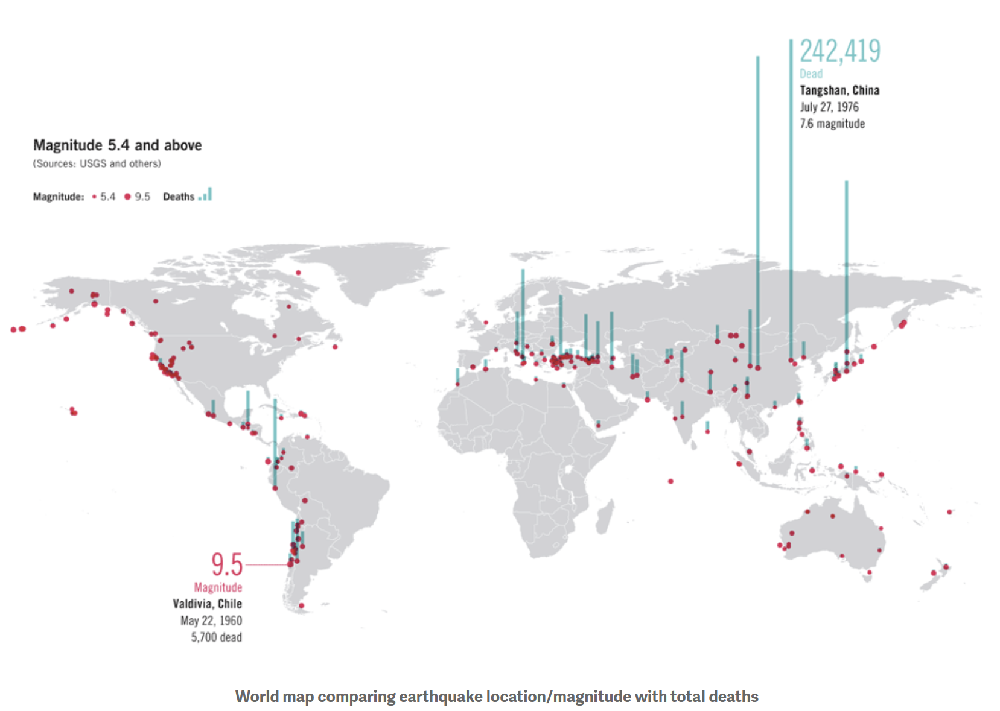

# Project of Data Visualization (COM-480)

| Student's name | SCIPER |
| -------------- | ------ |
| Zacharie Serge Janek Mizeret | 270849 |
| Andrija Kolić | 336957 |
| Ahmed Reda Seghrouchni | 297848 |

[Setup and Usage](#setup) • [Milestone 1](#milstone-1) • [Milestone 2](#milestone-2) • [Milestone 3](#milestone-3)

# Setup
In order to setup this project, an HTTP server must be created within the project folder. There are a variety of ways to do so:

### Live Server Extension
The live server extension can be installed in VSCode and then the user can go to the [index.html](project/index.html) and click the *Go Live* button at the bottom of the page. The web browser should launch automatically at the right address.


### Python Server
Another posibility is to use the built in python http.server command. The user must navigate to the [project](project) folder and launch the server using the following command:
```
python3 -m http.server
```
A HTTP server will then be launched (normally on port 8000, although it can be set manually), the user then simply has to go to any web navigator and go to [localhost:8000](https://localhost:8000)

# Usage
## Controls
In order to control the plane the user must use the **WAD** keys to move nagivate. Just as a normal plane, the user cannot move backwards, and in order to turn the plane must be moving forward. Hence to turn left for example the user must be holding both **W** and **A**.

For additional information about a specific disaster, the user can hover the mouse over any of the locations and the disaster (along with all its locations) will be highlighted and a textbox will appear with additional information.

## UI
To select which types of disasters should be shown on the screen, two main UI elements exist:

### Timeline Slider

A timeline is displayed at the top of the screen which the user can scroll through to select which year of disasters should be rendered on the globe. Alternatively the user can use the **UP ARROW** and **DOWN ARROW** to increment or decrement the selected year.

### Disaster form

To select which types of disasters are to be displayed on the globe, the user has access to a form at the bottom right of the screen. Any selected disaster will be displayed on the screen, while un-selected ones will not appear. The color of the disasters correspond to the color of the checkboxes in the form.

## Intended use
Once the user has been informed of the controls, they are free to roam around the globe and explore the various disasters that occured on earth throughout the years.


# Milestones
## Milestone 1

**10% of the final grade**

This is a preliminary milestone to let you set up goals for your final project and assess the feasibility of your ideas.
Please, fill the following sections about your project.

*(max. 2000 characters per section)*

### Dataset

> Find a dataset (or multiple) that you will explore. Assess the quality of the data it contains and how much preprocessing / data-cleaning it will require before tackling visualization. We recommend using a standard dataset as this course is not about scraping nor data processing.
>
> Hint: some good pointers for finding quality publicly available datasets ([Google dataset search](https://datasetsearch.research.google.com/), [Kaggle](https://www.kaggle.com/datasets), [OpenSwissData](https://opendata.swiss/en/), [SNAP](https://snap.stanford.edu/data/) and [FiveThirtyEight](https://data.fivethirtyeight.com/)), you could use also the DataSets proposed by the ENAC (see the Announcements section on Zulip).

The dataset consists of 15,827 samples and 43 features. The features that will definitely be of interest to us are:
- Geospatial features: 'Continent', 'Region', 'Country', 'Location', 'Latitude' and 'Longitude';
- Temporal features: 'Year';
- Disaster Category features: 'Disaster Subgroup', 'Disaster Type', 'Disaster Subtype';
- Impact features: 'Total Deaths', 'No Injured', 'No Affected', 'No Homeless', 'Total Affected', 'Total Damages ('000 US$)'.

The geospatial information is very important for us in order to properly position the disasters on the map. Latitude and Longitude provide the most precise location in a easily usable manner, but are unfortunately not available for 13,114 rows. The Location feature is present for most of the entries (missing for 1808), however, this feature is difficult to use, since we would have to somehow map the 1808 locations to coordinates in order to present them on the map. Finally, the Country feature is present for all of the entries, and provides a decent fallback (especially for smaller countries).

The disasters in the dataset range from the year 1900 to 2021. The temporal information allows us to present the disasters at a certain moment/time-range, giving insight into the history of natural disasters, while also providing us with a convenient way to filter out entries so as not to overwhelm the user.

The other features will be used to determine the design of objects representing the disasters, as well as to provide some additional information.

There are some country names which need to be standardized in order to match with the needed libraries. This renaming process has already been done in the prepareAndPlotMap function in the notebook.

The biggest obstacle we would need to tackle is figuring out the position of the disasters, and if we decide to use the Location feature that will require a decent ammount of pre-processing.


### Problematic

> Frame the general topic of your visualization and the main axis that you want to develop.
> - What am I trying to show with my visualization?
> - Think of an overview for the project, your motivation, and the target audience.

Our interactive data visualization aims to provide a unique way of exploring natural disasters that have occured around the globe over the past century. Instead of a static map, we have designed an immersive experience that allows the user to become a pilot and fly around the world to visit different locations where natural disasters have occured. This approach adds an element of excitement and exploration to the visualization, making it more engaging for the user.

To ensure that the user can explore the data effectively, we have integrated the temporal aspect of the data into the simulation. The user will be able to control the speed of the simulation, pause it, or even reverse it. This functionality allows the user to investigate the data at their own pace and gain a deeper understanding of how nautral disasters have evolved over time.

For the spatial aspect of the data, the user will be able to fly around the glode using the plane controls. As the user navigates through different regions of the world, they will be able to see the types of natural disasters that have occured in each location. For example, they may fly over a region that has experienced multiple earthquakes, hurricanes, or floods. 

Overall, we believe that this approach to data visualization will attracts users who are curious and interested in exploring the world around them. It is not intended to be a quick summary of all natural disasters, but rather an immersive experience that encourages the user to engage with the data and explore it at their own pace. By creating a visualizatoin that is interactive and engaging, we hope to provide users with a deeper understanding of natural disasters and their impact on the world.

### Exploratory Data Analysis

> Pre-processing of the data set you chose
> - Show some basic statistics and get insights about the data

The disasters aren't distributed evenly throughout the observed time range. There are very few entries before the 50's when the number starts rising slowly. Compared to the data we have from the 90's onwards, everything before seems like it wasn't meticulously collected. To adjust to this distribution, we will probable have to present different ranges of time depending on the chosen year (e.g. if you want to look at the beginning of the range, maybe we would show all of the disasters that happened throughout the decade, but for the end of the range we could show yearly data).


Looking at the geospatial distribution of the disasters, we can see that there's a lot of diverse representation. Smaller countries obviously have less events, but when looking at it at the continent level, there is no continent that's unrepresented.


When we take a closer look, by restricting the time range we can see that the events aren't really evenly distributed. Countries like the US and China have seemingly a lot of disasters every year, while some other countries (even large ones) appear much more rarely. If we go further back in time, the map becomes very sparse.


Another issue becomes apparent when selecting only events up until 1990, a lot of Eastern European and Central Asian countries are completely blank - the cause of this is that we are using only contemporary countries when mapping out disasters, something we will have to look into going forward.


### Related work


> - What others have already done with the data?
> - Why is your approach original?
> - What source of inspiration do you take? Visualizations that you found on other websites or magazines (might be unrelated to your data).
> - In case you are using a dataset that you have already explored in another context (ML or ADA course, semester project...), you are required to share the report of that work to outline the differences with the submission for this class.

When we were searching for an idea for our data visualization project, we remembered the recent earthquakes that occured in Turkey. As we were reseaching the topic, we cam across a dataset that contained information on natural disasters from around the globe over the past century. However we still needed a way to present the data in an engaging and immersive manner. 

Whilst looking for inspiration for the visualization, one of the group members recalled a Youtube video by Sebastien Lague, which showcased an interesting perspective of the world from a small toy plane which he created himself in Unity. We thought that this woul dbe a unique way to present the natural disaster data, and it would allow users to explore the world in an engaging and immersive way. Hence, we decided to combine the idea of the plane with the dataset to create our final idea for an interactive data visualization that we hope will inspire curiosity and awareness of the impact of natural disasters.

From our research, most visualizations of natural disaster datasets have typically used static maps or graphs to display the locations and sizes of the events. Whilst these visualizations can be useful for converying the information, the thought they did not engage the user enough.

### Inspiration for plane visualization


### Example of current work

source: https://christophercannon.net/disasters.html


### Implementation
A quick side note about how we intend to implement our project, the aim is to use WebGL along with Javascript to render the mini "game" we plan to create. WebGL is a graphics library that allows rendering through browsers like chrome. Our inspiration for the plane comes from Sebastien Lague as mentioned, however we do not plan to copy his (open source) Unity code but rather recreate a similar interaction with WebGL.

## Milestone 2

**10% of the final grade**

Report is [here](Milestone2Files/Milestone2_Report.pdf)

Prototype is described in the report.

## Milestone 3

**80% of the final grade**

Process book is [here](Milestone3Files/processbook.pdf)

Screencast is [here](Milestone3Files/screencast.mp4)


## Late policy

- < 24h: 80% of the grade for the milestone
- < 48h: 70% of the grade for the milestone

